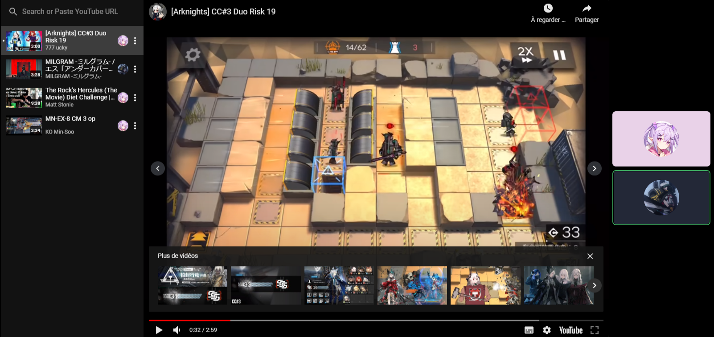

# Issho
Discord bot that use that use the preview feature to play games and watch videos together in voice channels

## Invite link
https://discord.com/api/oauth2/authorize?client_id=842138362810073098&permissions=2049&scope=bot

The bot need the "Send Messages" and "Create Instant Invites" permissions

## How does it works?
```
i.play gameName
```

Examples:
```
i.play youtube together
```
```
i.play poker night
```

You can do the play command without any argument to see the full list of games
```
i.play
```

## Need something else?
Open an issue or a discussion here

## Preview
